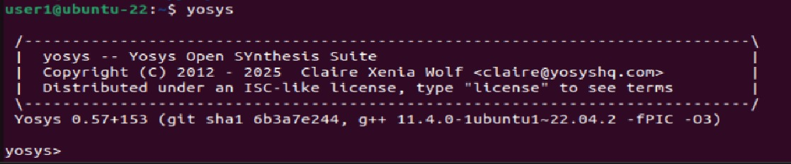
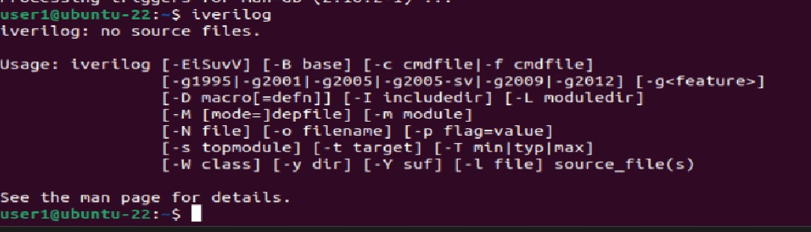
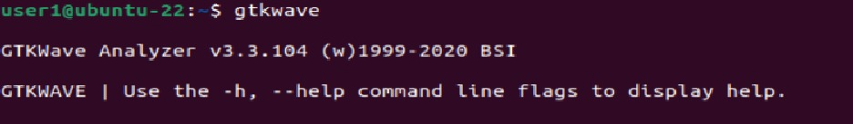

# 🚀 RISC-V Reference SoC Tapeout Program (VSD)

## 📌 Overview  
This project is part of the **VSD RISC-V Reference SoC Tapeout Program**, focused on building and simulating a minimal SoC based on the RISC-V architecture. The goal is to set up a complete open-source digital design flow, from RTL simulation to waveform analysis, using **Yosys, Icarus Verilog, and GTKWave**.  

---

## 🛠️ Tools & Environment Setup  

### ✅ System Requirements  
- **OS**: Ubuntu 20.04 or higher  
- **RAM**: 6 GB (minimum)  
- **Storage**: 50 GB free space  
- **CPU**: 4 vCPU recommended  

---

### 📺 Resizing Ubuntu VM for Better Display  
```bash
sudo apt update
sudo apt install build-essential dkms linux-headers-$(uname -r)
cd /media/<username>/VBox_GAs_7.1.8/
./autorun.sh
```


## 🔧 Tool Installation & Verification  

#### 1️⃣ <ins>Yosys (Synthesis Tool) </ins> 

```bash
sudo apt-get update
git clone https://github.com/YosysHQ/yosys.git
cd yosys
sudo apt install make build-essential clang bison flex \
    libreadline-dev gawk tcl-dev libffi-dev git \
    graphviz xdot pkg-config python3 libboost-system-dev \
    libboost-python-dev libboost-filesystem-dev zlib1g-dev
make config-gcc
git submodule update --init --recursive
make
sudo make install
```



### 2️⃣ <ins>Icarus Verilog (Simulation Tool)</ins>

```bash
sudo apt-get update
sudo apt-get install iverilog
```


### 3️⃣ <ins>GTKWave (Waveform Viewer)</ins>

```bash
sudo apt-get update
sudo apt install gtkwave
```



