# 🚀 RISC-V SoC Physical Design Flow using OpenROAD

<div align="center">

[](https://github.com/The-OpenROAD-Project/OpenROAD-flow-scripts)
[](https://github.com/google/skywater-pdk)
[](https://riscv.org/)
[]()

</div>

---

## 📋 Table of Contents

- [Overview](#-overview)
- [Week 7 Task Deliverables](#-week-7-task-deliverables)
- [Project Architecture](#-project-architecture)
- [Installation & Setup](#-installation--setup)
- [Design Flow](#-design-flow)
  - [Directory Structure](#1-directory-structure-setup)
  - [File Organization](#2-file-organization)
  - [Configuration](#3-configuration-setup)
  - [Synthesis](#4-synthesis)
  - [Floorplan](#5-floorplan)
  - [Placement](#6-placement)
  - [Clock Tree Synthesis](#7-clock-tree-synthesis-cts)
  - [Routing](#8-routing)
  - [Post-Route SPEF Generation](#9-post-route-spef-generation)
- [Results Summary](#-results-summary)
- [Task Completion Checklist](#-task-completion-checklist)
- [Key Takeaways](#-key-takeaways)

---

## 🎯 Overview

This project demonstrates the **complete RTL-to-GDSII physical design flow** for **VSDBabySoC** - a RISC-V based System-on-Chip using **OpenROAD Flow Scripts (ORFS)** and **SkyWater 130nm PDK**.

> 📌 **Week 7 Deliverable**: BabySoC Physical Design & Post-Route SPEF Generation
> 
> This task integrates the complete physical design flow from floorplanning through routing, with emphasis on post-route parasitic extraction for accurate timing analysis.

### 🔑 Key Components

| Component | Description | Type |
|-----------|-------------|------|
| **RVMyth** | 5-stage pipelined RISC-V CPU core | Digital |
| **AVSD PLL** | Analog Phase-Locked Loop | Analog Macro |
| **AVSD DAC** | Digital-to-Analog Converter | Analog Macro |

### 🎨 Technology Stack


---

## ✅ Week 7 Task Deliverables

### 📋 Task Objective

To perform **complete Physical Design** for BabySoC using OpenROAD — covering floorplanning, placement, routing, and **post-route SPEF generation** — and understand how all stages integrate in a real SoC design flow.

### 🎯 Why This Task Matters

This task integrates everything learned into a complete physical design flow:

- ✅ Experience full **RTL-to-layout** process
- ✅ Understand impact of floorplan, placement density, and routing on **timing**
- ✅ Learn significance of **post-route parasitic extraction (SPEF)**
- ✅ Connect theory of STA with real-world SoC implementation

### 📦 Required Deliverables

| # | Deliverable | Status | Section |
|---|-------------|--------|----------|
| 1️⃣ | **Floorplan View** | ✅ Complete | [Floorplan](#5-floorplan) |
| 2️⃣ | **Placement View** | ✅ Complete | [Placement](#6-placement) |
| 3️⃣ | **Routed Design** | ✅ Complete | [Routing](#8-routing) |
| 4️⃣ | **SPEF Generation** | ✅ Complete | [SPEF](#9-post-route-spef-generation) |
| 5️⃣ | **Documentation** | ✅ Complete | This README |
| 6️⃣ | **Verification** | ✅ Complete | [Results](#-results-summary) |

---

## 🏗️ Project Architecture

```
┌─────────────────────────────────────────────────────┐
│              VSDBabySoC Top Module                  │
│  ┌───────────────────────────────────────────────┐  │
│  │         RVMyth RISC-V Core                    │  │
│  │  ┌──────────┐  ┌──────────┐  ┌──────────┐    │  │
│  │  │   IF     │→ │   ID     │→ │   EX     │    │  │
│  │  └──────────┘  └──────────┘  └──────────┘    │  │
│  │  ┌──────────┐  ┌──────────┐                  │  │
│  │  │   MEM    │→ │   WB     │                  │  │
│  │  └──────────┘  └──────────┘                  │  │
│  └───────────────────────────────────────────────┘  │
│                        ↕                             │
│  ┌──────────────┐            ┌──────────────┐       │
│  │  AVSD PLL    │ ────────→  │  AVSD DAC    │       │
│  │ (Clk Gen)    │            │ (Analog Out) │       │
│  └──────────────┘            └──────────────┘       │
└─────────────────────────────────────────────────────┘
```

---

## 🛠️ Installation & Setup

### Step 1: Clone OpenROAD Flow Scripts
#### 📍 Follow week5 for Installation of OpneRoad Flow Scripts 
```bash
https://github.com/irajPatel/irajPatel_RISC-V-SoC-Tapeout-Program_VSD?tab=readme-ov-file#-week-5--openroad-flow-setup--floorplan--placement
```


---

## 🔄 Design Flow

```mermaid
graph TD
    A[📁 Setup Directories] --> B[📄 Organize Files]
    B --> C[⚙️ Configure Design]
    C --> D[🔧 Synthesis]
    D --> E[📐 Floorplan]
    E --> F[📍 Placement]
    F --> G[🕐 Clock Tree Synthesis]
    G --> H[🛣️ Routing]
    H --> I[✅ GDSII Output]
    
    style A fill:#e3f2fd
    style D fill:#fff3e0
    style E fill:#f3e5f5
    style F fill:#e8f5e9
    style G fill:#fce4ec
    style H fill:#e0f2f1
    style I fill:#c8e6c9
```



---

### 1️⃣ Directory Structure Setup

#### Create Design Directories

```bash
cd /home/iraj/OpenROAD-flow-scripts/flow

# 📁 Create platform-specific design directory
mkdir -p designs/sky130hd/vsdbabysoc

# 📁 Create source directory
mkdir -p designs/src/vsdbabysoc
```

#### 📂 Directory Purpose

| Directory | Purpose | Contents |
|-----------|---------|----------|
| `designs/sky130hd/vsdbabysoc/` | Platform-specific configs | LEF, LIB, GDS, SDC, constraints |
| `designs/src/vsdbabysoc/` | RTL source files | Verilog modules, includes |

---

### 2️⃣ File Organization

#### 📥 Copy Verilog Source Files

Navigate to the flow directory:
```bash
cd /home/iraj/OpenROAD-flow-scripts/flow
```

**Copy digital design files:**
```bash
cp /home/iraj/OpenROAD-flow-scripts/VSDBabySoC/src/module/vsdbabysoc.v designs/src/vsdbabysoc/
cp /home/iraj/OpenROAD-flow-scripts/VSDBabySoC/src/module/rvmyth.v designs/src/vsdbabysoc/
cp /home/iraj/OpenROAD-flow-scripts/VSDBabySoC/src/module/clk_gate.v designs/src/vsdbabysoc/
cp /home/iraj/OpenROAD-flow-scripts/VSDBabySoC/src/module/rvmyth_gen.v designs/src/vsdbabysoc/
```

**Copy analog macro blackbox files:**
```bash
cp /home/iraj/OpenROAD-flow-scripts/VSDBabySoC/src/module/avsddac.v designs/src/vsdbabysoc/
cp /home/iraj/OpenROAD-flow-scripts/VSDBabySoC/src/module/avsdpll.v designs/src/vsdbabysoc/
```

#### 📊 Source File Structure

```
designs/src/vsdbabysoc/
├── 📄 vsdbabysoc.v       ← Top-level module
├── 📄 rvmyth.v           ← RISC-V core wrapper
├── 📄 rvmyth_gen.v       ← RISC-V core implementation
├── 📄 clk_gate.v         ← Clock gating logic
├── 📄 avsddac.v          ← DAC macro (blackbox)
└── 📄 avsdpll.v          ← PLL macro (blackbox)
```

#### 📥 Copy Technology Files

```bash
# Copy GDSII layouts for analog macros
cp -r /home/iraj/OpenROAD-flow-scripts/VSDBabySoC/src/gds designs/sky130hd/vsdbabysoc/

# Copy LEF (physical abstracts)
cp -r /home/iraj/OpenROAD-flow-scripts/VSDBabySoC/src/lef designs/sky130hd/vsdbabysoc/

# Copy LIB (timing libraries)
cp -r /home/iraj/OpenROAD-flow-scripts/VSDBabySoC/src/lib designs/sky130hd/vsdbabysoc/

# Copy include files (Verilog headers)
cp -r /home/iraj/OpenROAD-flow-scripts/VSDBabySoC/src/include designs/sky130hd/vsdbabysoc/
```

> ⚠️ **IMPORTANT:** Remove duplicate standard cell library
> ```bash
> rm designs/sky130hd/vsdbabysoc/lib/sky130_fd_sc_hd__tt_025C_1v80.lib
> ```

#### 📊 Technology File Structure

```
designs/sky130hd/vsdbabysoc/
├── 📁 gds/
│   ├── avsddac.gds
│   └── avsdpll.gds
├── 📁 lef/
│   ├── avsddac.lef
│   └── avsdpll.lef
├── 📁 lib/
│   ├── avsddac.lib
│   └── avsdpll.lib
└── 📁 include/
    ├── sandpiper.vh
    ├── sandpiper_gen.vh
    ├── sp_default.vh
    └── sp_verilog.vh
```

#### 📥 Copy Configuration Files

```bash
# Copy SDC constraints
cp /home/iraj/OpenROAD-flow-scripts/VSDBabySoC/src/sdc/vsdbabysoc_synthesis.sdc \
   designs/sky130hd/vsdbabysoc/

# Copy macro placement file
cp /home/iraj/OpenROAD-flow-scripts/VSDBabySoC/src/layout_conf/vsdbabysoc/macro.cfg \
   designs/sky130hd/vsdbabysoc/

# Copy pin order file
cp /home/iraj/OpenROAD-flow-scripts/VSDBabySoC/src/layout_conf/vsdbabysoc/pin_order.cfg \
   designs/sky130hd/vsdbabysoc/
```

---

### 3️⃣ Configuration Setup

#### 🔧 Fix Liberty Files (Critical!)

**Problem:** Power/ground pins defined as regular pins causing parser errors.

**Files to modify:** `avsddac.lib` and `avsdpll.lib`

##### 📝 File: `designs/sky130hd/vsdbabysoc/lib/avsdpll.lib`

**❌ Before (Incorrect):**
```liberty
pin (GND) {
  direction : input;
  max_transition : 2.5;
  capacitance : 0.001;
}

pin (VDD) {
  direction : input;
  max_transition : 2.5;
  capacitance : 0.001;
}
```

**✅ After (Correct):**
```liberty
pg_pin (GND) {
  voltage_name : GND;
  pg_type : primary_ground;
}

pg_pin (VDD) {
  voltage_name : VDD;
  pg_type : primary_power;
}
```

##### 📝 File: `designs/sky130hd/vsdbabysoc/lib/avsddac.lib`

**❌ Before (Incorrect):**
```liberty
pin (VSSA) {
  direction : input;
  max_transition : 2.5;
  capacitance : 0.001;
}

pin (VDDA) {
  direction : input;
  max_transition : 2.5;
  capacitance : 0.001;
}

pin (VDDA) {
  direction : input;
  max_transition : 2.5;
  capacitance : 0.001;
}
```

**✅ After (Correct):**
```liberty
pg_pin (VSSA) {
  voltage_name : VSSA;
  pg_type : primary_ground;
}

pg_pin (VDDA) {
  voltage_name : VDDA;
  pg_type : primary_power;
}
```

---

### 4️⃣ Synthesis

#### 🔧 Run Synthesis

Navigate to the flow directory and source the environment:
```bash
cd OpenROAD-flow-scripts
source env.sh
cd flow
```

**Execute synthesis:**
```bash
make DESIGN_CONFIG=./designs/sky130hd/vsdbabysoc/config.mk synth
```

#### 📊 Synthesis Results


##### 📈 Synthesis Statistics


#### ✅ Synthesis Summary

| Metric | Value |
|--------|-------|
| **Tool** | Yosys |
| **Top Module** | vsdbabysoc |
| **Status** | ✅ Success |
| **Output** | Gate-level netlist |

---

### 5️⃣ Floorplan

#### 📐 Run Floorplan

```bash
make DESIGN_CONFIG=./designs/sky130hd/vsdbabysoc/config.mk floorplan
```

#### 📊 Floorplan Results


#### 🖼️ Visualize Floorplan

```bash
make DESIGN_CONFIG=./designs/sky130hd/vsdbabysoc/config.mk gui_floorplan
```


#### 📋 Floorplan Metrics

| Parameter | Description |
|-----------|-------------|
| **Die Area** | Total chip area allocated |
| **Core Area** | Area for standard cells |
| **Macro Placement** | PLL and DAC macros positioned |
| **IO Pins** | Pin locations defined |

---

### 6️⃣ Placement

#### 📍 Run Placement

```bash
make DESIGN_CONFIG=./designs/sky130hd/vsdbabysoc/config.mk place
```


#### 🖼️ Visualize Placement

```bash
make DESIGN_CONFIG=./designs/sky130hd/vsdbabysoc/config.mk gui_place
```

##### 📸 Placement Screenshots

**Overall Placement:**


**Density Heat Map:**


**Zoomed Placement:**


#### ✅ Placement Summary

| Metric | Status |
|--------|--------|
| **Global Placement** | ✅ Complete |
| **Detailed Placement** | ✅ Complete |
| **Legalization** | ✅ Success |
| **Density** | Optimized |

---

### 7️⃣ Clock Tree Synthesis (CTS)

#### 🕐 Run CTS

```bash
make DESIGN_CONFIG=./designs/sky130hd/vsdbabysoc/config.mk cts
```


#### 🖼️ Visualize Clock Tree

```bash
make DESIGN_CONFIG=./designs/sky130hd/vsdbabysoc/config.mk gui_cts
```

##### 📸 Clock Tree Screenshots

**Clock Network 1:**


**Clock Network 2:**


#### 📊 CTS Reports


#### 📈 CTS Metrics Summary

| Metric | Value | Status |
|--------|-------|--------|
| **TNS (Total Negative Slack)** | 0.00 ns | ✅ MET |
| **WNS (Worst Negative Slack)** | 0.00 ns | ✅ MET |
| **Worst Slack** | 5.55 ns | ✅ MET |
| **Clock Skew** | 0.65 ns | ✅ Good |
| **Setup Violations** | 0 | ✅ Clean |
| **Hold Violations** | 0 | ✅ Clean |
| **Max Cap Violations** | 2 | ⚠️ Minor |

#### 🔍 Detailed Timing Analysis

##### ⏱️ Setup Timing (Max Path)

| Parameter | Value |
|-----------|-------|
| **Startpoint** | `core.CPU_valid_taken_br_a5$_DFF_P_` |
| **Endpoint** | `core.CPU_Xreg_value_a4[7][13]$_SDFFE_PP0P_` |
| **Data Arrival Time** | 5.79 ns |
| **Data Required Time** | 11.34 ns |
| **Slack** | **5.55 ns** ✅ |

##### ⏱️ Hold Timing (Min Path)

| Parameter | Value |
|-----------|-------|
| **Startpoint** | `core.CPU_Xreg_value_a4[25][15]$_SDFFE_PP0P_` |
| **Endpoint** | `core.CPU_src2_value_a3[15]$_DFF_P_` |
| **Data Arrival Time** | 1.74 ns |
| **Data Required Time** | 1.74 ns |
| **Slack** | **0.00 ns** ✅ |

#### ⚡ Power Analysis

| Component | Internal Power | Switching Power | Leakage Power | Total Power | % |
|-----------|---------------|-----------------|---------------|-------------|---|
| **Sequential** | 6.95 mW | 0.97 mW | 14.5 pW | 7.92 mW | 37.7% |
| **Combinational** | 2.12 mW | 4.52 mW | 30.5 pW | 6.64 mW | 31.6% |
| **Clock** | 3.66 mW | 2.76 mW | 2.96 pW | 6.42 mW | 30.6% |
| **Total** | **12.7 mW** | **8.25 mW** | **48.0 pW** | **21.0 mW** | 100% |

---

### 8️⃣ Routing

#### 🛣️ Run Routing

```bash
make DESIGN_CONFIG=./designs/sky130hd/vsdbabysoc/config.mk route
```


#### ✅ Routing Summary

| Stage | Status |
|-------|--------|
| **Global Routing** | ✅ Complete |
| **Detailed Routing** | ✅ Complete |
| **DRC Violations** | 0 ✅ |
| **Antenna Violations** | Fixed |

---

### 9️⃣ Post-Route SPEF Generation

#### 📝 What is SPEF?

**SPEF (Standard Parasitic Exchange Format)** is an IEEE standard format for representing parasitic resistance and capacitance information of wires and interconnects in a chip design.

#### 🎯 Why SPEF is Critical


| Aspect | Pre-Route | Post-Route (with SPEF) |
|--------|-----------|------------------------|
| **Wire Modeling** | Ideal (zero delay) | Realistic R, C values |
| **Timing Accuracy** | Estimated (~30% error) | Accurate (< 5% error) |
| **Delay Calculation** | Wire load models | Actual parasitic extraction |
| **Purpose** | Optimization guidance | Final sign-off |

#### 🔧 Generate SPEF File

```bash
# Navigate to results directory
cd OpenROAD-flow-scripts/flow/results/sky130hd/vsdbabysoc/base

# SPEF file is automatically generated during routing
# Location: 6_final.spef
```

**Alternative manual generation:**
```bash
make DESIGN_CONFIG=./designs/sky130hd/vsdbabysoc/config.mk spef
```


#### 📊 SPEF File Structure

A typical SPEF file contains:

```spef
*SPEF "ieee 1481-1999"
*DESIGN "vsdbabysoc"
*DATE "16:13:34 Sunday November 16, 2025"
*VENDOR "The OpenROAD Project"
*PROGRAM "OpenROAD"
*VERSION "v2.0-22706-g9c4e436fd2"
*DESIGN_FLOW "NAME_SCOPE LOCAL" "PIN_CAP NONE"
*DIVIDER /
*DELIMITER :
*BUS_DELIMITER []
*T_UNIT 1 NS
*C_UNIT 1 PF
*R_UNIT 1 OHM
*L_UNIT 1 HENRY

*NAME_MAP
*1 CLK
*2 ENb_CP
*3 ENb_VCO
*4 net11
*5 REF
*6 RV_TO_DAC\[0\]
*7 RV_TO_DAC\[1\]
*8 RV_TO_DAC\[2\]
*9 RV_TO_DAC\[3\]
*10 RV_TO_DAC\[4\]
*11 RV_TO_DAC\[5\]
*12 RV_TO_DAC\[6\]
*13 RV_TO_DAC\[7\]
*14 RV_TO_DAC\[8\]
*15 RV_TO_DAC\[9\]
*16 VCO_IN
*CAP
1 *12834:D 0.000113333
2 *12997:LO 0.000113333
3 *12834:CLK *12834:D 0.000198052
4 *12964:D *12834:D 0.000119335
5 *6484:44 *12834:D 0.000200042
*RES
1 *12997:LO *12834:D 32.3611 
*END

*D_NET *6554 0.000834982
*CONN
*I *12837:D I *D sky130_fd_sc_hd__dfxtp_1
*I *12998:LO O *D sky130_fd_sc_hd__conb_1
*CAP
1 *12837:D 0.000233494
2 *12998:LO 0.000233494
3 *12837:CLK *12837:D 0.000367993
*RES
1 *12998:LO *12837:D 34.8526 
*END

*D_NET *6555 0.000337553
*CONN
*I *12839:D I *D sky130_fd_sc_hd__dfxtp_1
*I *12999:LO O *D sky130_fd_sc_hd__conb_1
*CAP
1 *12839:D 0.000118634
2 *12999:LO 0.000118634
3 *9521:A *12839:D 0.000100285
*RES
1 *12999:LO *12839:D 21.2773 
*END

```

#### 🔍 SPEF Content Breakdown

| Section | Description | Impact |
|---------|-------------|--------|
| **`*D_NET`** | Net definition with total capacitance | Overall load |
| **`*CONN`** | Connection points (pins, ports) | Connectivity |
| **`*CAP`** | Capacitance values (pF) | Delay, power |
| **`*RES`** | Resistance values (Ω) | IR drop, delay |

#### 📈 SPEF Impact on Timing

**Without SPEF (Pre-Route):**
```
Net delay = 0.1 ns (estimated)
Total path delay = 5.5 ns
```

**With SPEF (Post-Route):**
```
Net delay = 0.3 ns (extracted: R=25Ω, C=12fF)
Total path delay = 5.7 ns
```

> ⚠️ **Key Insight**: Post-route timing with SPEF is **always more accurate** than pre-route estimates. This is why **sign-off STA** requires SPEF.

#### ✅ Verify SPEF Generation

```bash
# Check if SPEF file exists
ls -lh results/sky130hd/vsdbabysoc/base/6_final.spef

# View SPEF statistics
head -n 50 results/sky130hd/vsdbabysoc/base/6_final.spef
```

#### 📊 Expected Output

```bash
-rw-r--r-- 1 user user 2.3M Nov 16 10:45 6_final.spef
```

#### 🔄 Using SPEF for Post-Route STA

```tcl
# In OpenSTA or PrimeTime
read_spef results/sky130hd/vsdbabysoc/base/6_final.spef
report_timing -path_delay max
report_timing -path_delay min
```

#### 📋 SPEF Quality Metrics

| Metric | Value | Quality |
|--------|-------|----------|
| **File Size** | ~2-5 MB | ✅ Normal for SoC |
| **Nets Extracted** | All signal nets | ✅ Complete |
| **RC Accuracy** | 3D field solver | ✅ High accuracy |
| **Format** | IEEE 1481-1998 | ✅ Industry standard |

#### 🎯 SPEF Use Cases

1. **Post-Route STA** - Accurate timing sign-off
2. **Power Analysis** - Dynamic power calculation from switching activity
3. **IR Drop Analysis** - Voltage drop on power/ground nets
4. **Signal Integrity** - Crosstalk and noise analysis
5. **Design Optimization** - Identify critical nets for ECO fixes

---

## 📊 Results Summary

### 🎯 Design Metrics

| Metric | Value | Status |
|--------|-------|--------|
| **Technology Node** | SkyWater 130nm | - |
| **Design** | VSDBabySoC (RISC-V SoC) | - |
| **Total Power** | 21.0 mW | ✅ |
| **Clock Period** | 11.05 ns (~90.5 MHz) | - |
| **Worst Setup Slack** | 6.55 ns | ✅ |
| **Worst Hold Slack** | 0.00 ns | ✅ |
| **Clock Skew** | 0.65 ns | ✅ |
| **Max Cap Violations** | 2 | ⚠️ |
| **Timing Violations** | 0 | ✅ |


<div align="center">

### 🎉 Project Status: **SUCCESSFUL** ✅

**RISC-V SoC Physical Design Complete**

</div>

---


